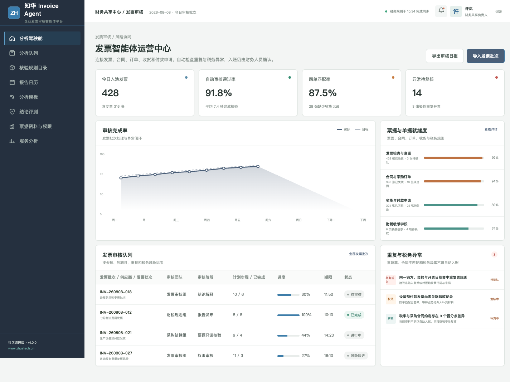
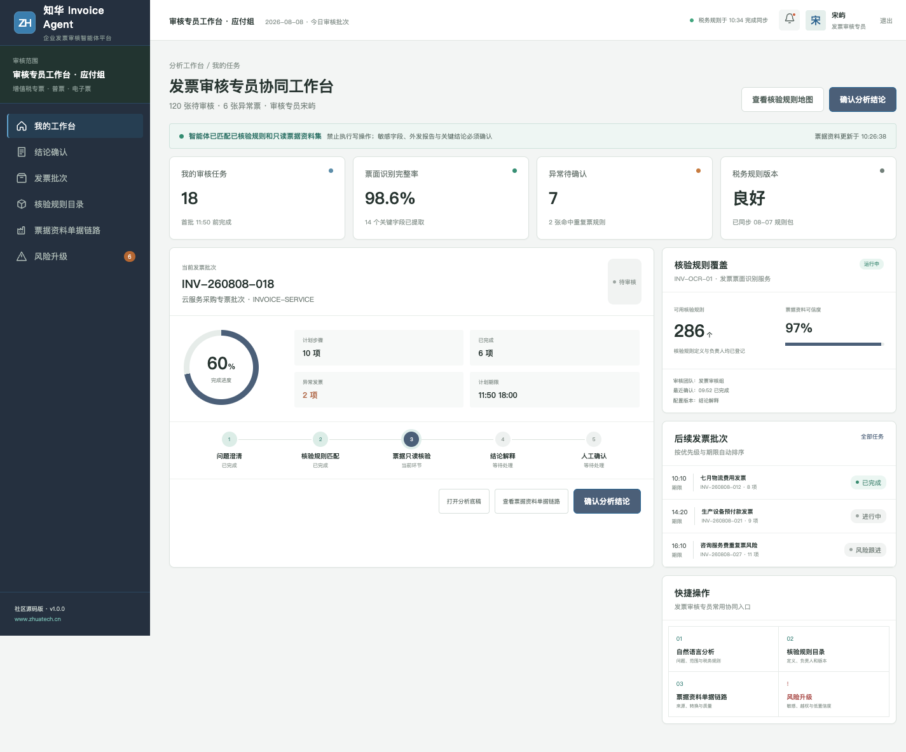

# InvoiceAgent｜企业发票审核智能体社区版

由[知华科技（上海如静知华信息科技有限公司）](https://www.zhuatech.cn/)维护。

InvoiceAgent 将发票识别、重复检查、合同/订单/收货/付款匹配、税务规则和人工复核组织成一套可审计的发票审核工作台。系统提供检查与建议，不代替财务人员作出入账和税务判断。

## 审核闭环

| 环节 | 社区版行为 | 人工责任 |
| --- | --- | --- |
| 票面识别 | 提取代码、号码、金额、税率和销方信息 | 核对原始票据 |
| 重复检查 | 组合字段与历史批次比对 | 确认冲红、重开等例外 |
| 四单匹配 | 关联合同、订单、收货和付款申请 | 判断业务真实性 |
| 税务核验 | 应用可配置规则并提示异常 | 财税人员作出结论 |
| 入账发布 | 生成审核结果草案 | 授权人员确认回写 |

管理端用于观察批次效率、异常分布和规则健康度；审核端聚焦当前发票、关联单据、风险证据及处理意见。

## 功能与工程实现

- 发票批次、供应商和到期时间管理
- OCR 结果结构化展示与人工校验
- 重复票、合同不匹配、税率异常提示
- 异常分派、复核、处理结果和审计记录
- Java 21 + Spring Boot + JWT + JPA 后端
- Vue 3 + Pinia + Vite 响应式前端
- MySQL 8 + Flyway，H2 自动化测试
- Docker Compose、Nginx、CI 与完整工程文档

领域规则位于 `InvoiceAuditService`，其决策路径和风险分数可测试、可解释。默认 Agent 运行时不会上传发票、调用第三方 OCR、访问税务系统或连接真实财务数据库。

## 快速体验

~~~bash
cd frontend
npm install
npm run dev:demo
~~~

浏览器打开 `http://localhost:5173`。管理端：`planner / Demo@2026`；审核端：`operator / Demo@2026`。

## 非商业许可

本工程**仅限个人学习、研究和非商业技术交流，不得商用**。企业内部使用、生产部署、财务系统集成、SaaS、收费服务、项目交付、二次销售或品牌替换，必须取得上海如静知华信息科技有限公司书面授权，详情参见 [LICENSE](LICENSE)。

商业授权、财务系统定制、私有化部署、AI 落地和软件外包，可访问[知华科技官网](https://www.zhuatech.cn/)或扫描下方微信二维码。

| 方案咨询 | 项目合作 |
| --- | --- |
|  |  |

SEO：发票审核 Agent、智能发票管理、四单匹配、财务共享中心、Java Vue MySQL、企业 AI 转型、知华科技。
